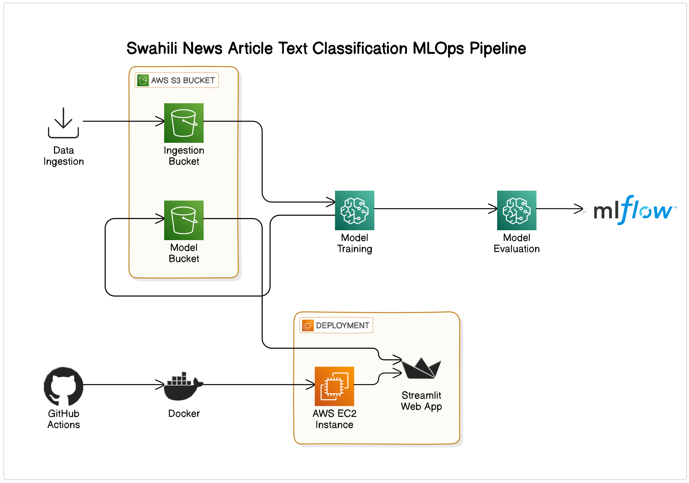
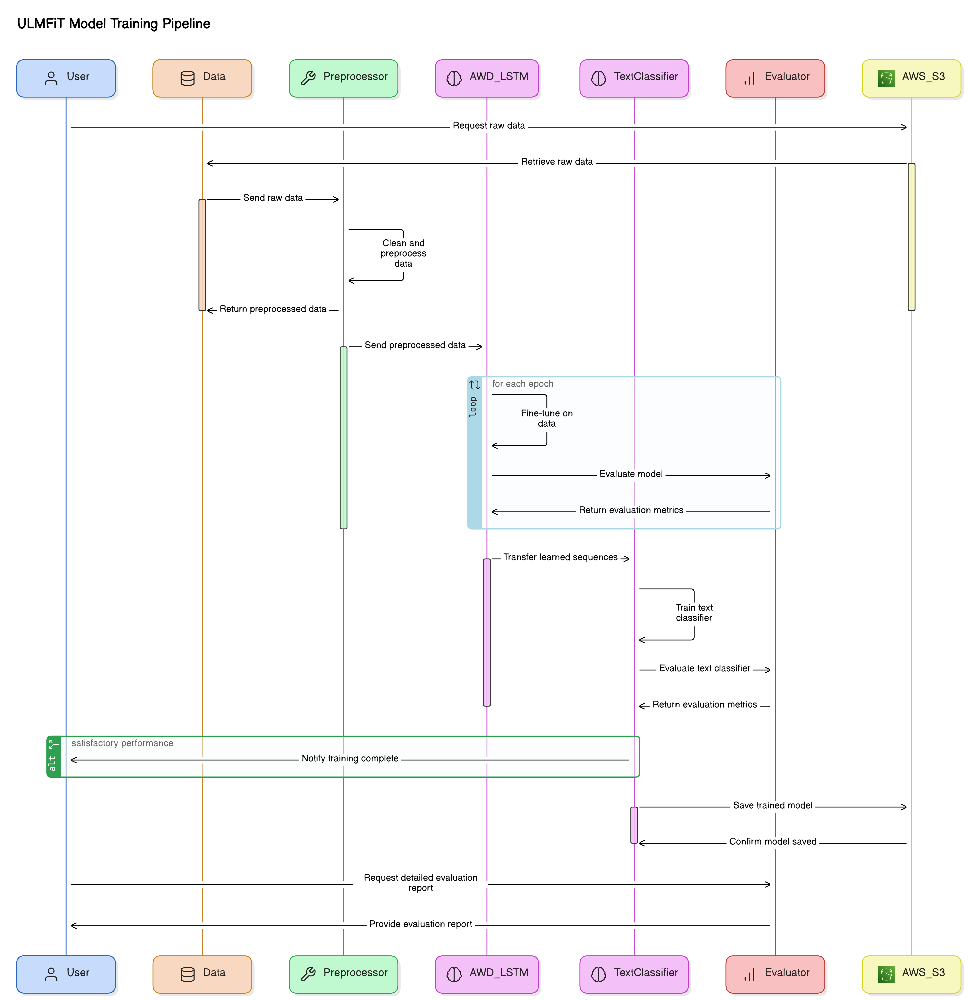

### Swahili-News-Classifier

Swahili is spoken by 100-150 million people across East Africa. In Tanzania, it is one of two national languages (the other is English) and it is the official language of instruction in all schools. News in Swahili is an important part of the media sphere in Tanzania.

News contributes to education, technology, and the economic growth of a country, and news in local languages plays an important cultural role in many Africa countries. In the modern age, African languages in news and other spheres are at risk of being lost as English becomes the dominant language in online spaces.

The objective of this hackathon is to develop a multi-class classification model to classify news content according to their specific categories specified.The model can be used by Swahili online news platforms to automatically group news according to their categories and help readers find the specific news they want to read. In addition, the model will contribute to a body of work ensuring that Swahili is represented in apps and other online products in the future.

### System Architecture



### ULMFiT Model Training Pipeline



### Folder structure

```
├── app.py
├── artifacts
│   └── data_ingestion
│       ├── compressed
│       │   ├── test_data.zip
│       │   └── train_data.zip
│       └── decompressed
│           ├── Test.csv
│           └── Train.csv
├── autopep.py
├── bfg.jar
├── codecov.yml
├── configuration
│   └── configuration.yaml
├── Dockerfile
├── dvc.yaml
├── LICENSE
├── logs
│   ├── 20240608-124455.log
│   ├── 20240608-172339.log
│   ├── 20240608-172525.log
│   ├── 20240608-172559.log
│   ├── 20240608-173514.log
│   ├── 20240608-173643.log
│   ├── 20240608-173740.log
│   ├── 20240608-174011.log
│   ├── 20240608-174135.log
│   ├── 20240608-174314.log
│   ├── 20240608-175835.log
│   ├── 20240608-180027.log
│   ├── 20240608-180124.log
│   ├── 20240608-180221.log
│   ├── 20240608-180323.log
│   ├── 20240608-220709.log
│   ├── 20240608-221302.log
│   ├── 20240608-221405.log
│   ├── 20240608-221929.log
│   ├── 20240608-222301.log
│   ├── 20240608-222351.log
│   ├── 20240609-115543.log
│   ├── 20240609-152329.log
│   ├── 20240611-123013.log
│   ├── 20240611-130747.log
│   └── 20240611-130938.log
├── main.py
├── models
│   ├── model_name.pth
│   └── text_classifier_learner.pkl
├── parameters.yaml
├── README.md
├── requirements.txt
├── research
│   ├── 01_data_ingestion.ipynb
│   ├── 02_model_training.ipynb
│   └── trails.ipynb
├── setup.py
├── src
│   ├── swahiliNewsClassifier
│   │   ├── components
│   │   │   ├── data_ingestion.py
│   │   │   ├── __init__.py
│   │   │   ├── model_training_and_evaluation.py
│   │   │   └── __pycache__
│   │   │       ├── data_ingestion.cpython-311.pyc
│   │   │       ├── data_ingestion.cpython-38.pyc
│   │   │       ├── __init__.cpython-311.pyc
│   │   │       └── __init__.cpython-38.pyc
│   │   ├── configuration
│   │   │   ├── configuration.py
│   │   │   ├── __init__.py
│   │   │   └── __pycache__
│   │   │       ├── configuration.cpython-311.pyc
│   │   │       ├── configuration.cpython-38.pyc
│   │   │       ├── __init__.cpython-311.pyc
│   │   │       └── __init__.cpython-38.pyc
│   │   ├── constants
│   │   │   ├── __init__.py
│   │   │   └── __pycache__
│   │   │       ├── __init__.cpython-311.pyc
│   │   │       └── __init__.cpython-38.pyc
│   │   ├── entity
│   │   │   ├── entities.py
│   │   │   ├── __init__.py
│   │   │   └── __pycache__
│   │   │       ├── entities.cpython-311.pyc
│   │   │       ├── entities.cpython-38.pyc
│   │   │       ├── __init__.cpython-311.pyc
│   │   │       └── __init__.cpython-38.pyc
│   │   ├── __init__.py
│   │   ├── pipeline
│   │   │   ├── __init__.py
│   │   │   ├── __pycache__
│   │   │   │   ├── __init__.cpython-311.pyc
│   │   │   │   └── stage_01_data_ingestion.cpython-311.pyc
│   │   │   ├── stage_01_data_ingestion.py
│   │   │   └── stage_02_model_training_and_evaluation.py
│   │   ├── __pycache__
│   │   │   ├── __init__.cpython-311.pyc
│   │   │   └── __init__.cpython-38.pyc
│   │   └── utilities
│   │       ├── helper_functions.py
│   │       ├── _init__.py
│   │       └── __pycache__
│   │           ├── helper_functions.cpython-311.pyc
│   │           └── helper_functions.cpython-38.pyc
│   └── swahiliNewsClassifier.egg-info
│       ├── dependency_links.txt
│       ├── PKG-INFO
│       ├── SOURCES.txt
│       └── top_level.txt
├── static
│   ├── architecture.png
│   └── model_training_pipeline_large.png
├── template.py
└── tests
    ├── conftest.py
    ├── __init__.py
    ├── __pycache__
    │   ├── conftest.cpython-311-pytest-7.4.0.pyc
    │   ├── __init__.cpython-311.pyc
    │   └── test_data_ingestion.cpython-311-pytest-7.4.0.pyc
    └── test_data_ingestion.py

```

### How to install

Clone the repository

```bash
git clone https://github.com/MartinKalema/Swahili-News-Classifier
```

Create a conda environment after opening the repository and activate it

```bash
conda create -n classifier python=3.8 -y
conda activate classifier
```

Install the requirements

```python
pip install -r requirements.txt
```

Create an AWS S3 Bucket and finally an environment file with the configurations below

```
AWS_ACCESS_KEY_ID='...'
AWS_SECRET_ACCESS_KEY='...'
REGION_NAME='...eg us-east-1"
```

Connect the project to dagshub and get the experiments configuration.

```
MLFLOW_TRACKING_URI='...'
MLFLOW_REPO_OWNER='...'
MLFLOW_REPO_NAME='...'

```

Initiate the pipeline

```python
python main.py
```

### Unit Tests

To run the unit tests, run the command below.

```bash
pytest tests/test_file_name.py
```
